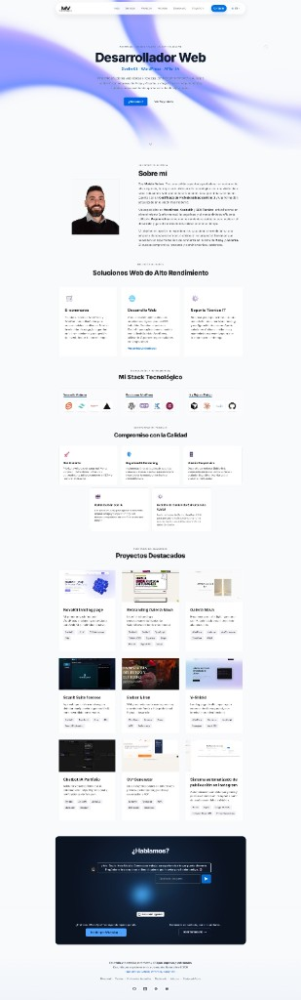

# Moises Valero Portfolio

Portfolio profesional de [moisesvalero.es](https://moisesvalero.es), construido con **SvelteKit 2**, **Svelte 5**, **TypeScript** y **Sanity**. El proyecto combina una experiencia visual cuidada con SEO técnico, contenido editable desde CMS y endpoints server-side para captación de leads.



## Enlaces

- **Web:** [moisesvalero.es](https://moisesvalero.es)
- **Stack principal:** SvelteKit, Svelte 5, TypeScript, Sanity, Vercel
- **Objetivo:** portfolio personal, landings SEO locales y casos de proyecto

## Qué demuestra este proyecto

- Interfaz moderna con modo oscuro, animaciones, microinteracciones y diseño responsive.
- Arquitectura SvelteKit con rutas públicas, endpoints server-side y datos híbridos CMS/fallback local.
- SEO avanzado: sitemap, robots, canonical, hreflang, JSON-LD, `llms.txt` y twins Markdown para AEO/GEO.
- Integraciones reales: Sanity CMS, Resend, analizador web propio, IndexNow y Typebot.
- Cuidado de producción: variables privadas en servidor, `.env.example`, rate limits y honeypots.

## Stack técnico

| Área | Tecnología |
| --- | --- |
| Frontend | SvelteKit 2, Svelte 5, TypeScript, Vite |
| CMS | Sanity |
| Deploy | Vercel / adapter auto |
| UI | CSS custom, animaciones propias |
| Email/leads | Resend, formularios server-side |
| SEO/AEO | JSON-LD, sitemap, robots, llms.txt, Markdown twins |
| Analítica/auditoría | GA4 opcional, analizador web propio |

## Funcionalidades principales

- Home portfolio con presentación, stack, trayectoria, servicios y proyectos.
- Páginas de proyecto en `/proyectos/*`.
- Landings SEO para servicios web en `/diseno-web` y `/diseno-web-alcoy`.
- Blog/artículos por slug desde Sanity.
- Cambio de idioma `es/en` con cookie httpOnly.
- Formulario de contacto y redirección server-side a WhatsApp.
- Analizador web propio con captura de lead.
- Webhook Sanity -> IndexNow para notificar contenido nuevo o actualizado.

## Estructura del proyecto

```txt
src/
  routes/
    +layout.server.ts            # locale, site config, canonical/noindex
    api/
      contact/                   # formulario + WhatsApp
      locale/                    # cambio de idioma
      web-audit/                 # analizador + captura lead
      indexnow/submit/           # envío manual a IndexNow
      webhooks/sanity/indexnow/  # auto IndexNow al publicar en Sanity
    diseno-web*/                 # landings SEO
    proyectos/                   # casos/proyectos
  lib/
    components/                  # bloques UI/landing/portfolio
    server/                      # fetch a Sanity, mapeos y lógica server
    data/                        # defaults/fallbacks locales
sanity/
  schemaTypes/                   # esquemas CMS
  seed-*.ts / patch-*.ts         # scripts de seed/migración
static/
  fonts/                         # fuentes autoalojadas
  imagenes/                      # assets públicos del portfolio
```

## Desarrollo local

```bash
npm install
npm run dev
```

Validación antes de desplegar:

```bash
npm run check
npm run build
```

Scripts útiles:

```bash
npm run preview
npm run studio
npm run sanity:patch-og
npm run sanity:clone-landing-national
npm run sanity:hero-marquee
npm run sanity:seed-support-articles
```

## Variables de entorno

Duplica `.env.example` como `.env` y configura solo lo que necesites. El proyecto puede funcionar con datos locales si Sanity no está configurado.

### Base

- `PUBLIC_SITE_URL`: URL pública del sitio.
- `PUBLIC_GA_MEASUREMENT_ID`: GA4 opcional, solo se carga tras consentimiento de cookies.

### Sanity

- `SANITY_PROJECT_ID`
- `SANITY_DATASET`
- `SANITY_API_VERSION`
- `SANITY_READ_TOKEN`: opcional si algún asset privado necesita proxy.
- `SANITY_WRITE_TOKEN`: solo para scripts o APIs con escritura.

### Captación y analizador

- `WEB_AUDIT_MAX_CALLS_PER_DAY`
- `WEB_AUDIT_RATE_LIMIT_PER_HOUR`
- `RESEND_API_KEY`
- `CONTACT_TO_EMAIL`
- `CONTACT_FROM_EMAIL`
- `WHATSAPP_E164`

### IndexNow y webhooks

- `INDEXNOW_KEY`
- `INDEXNOW_SUBMIT_TOKEN`
- `SANITY_WEBHOOK_TOKEN`

## Endpoints API relevantes

| Endpoint | Uso |
| --- | --- |
| `POST /api/contact/form` | Envío de formulario por email con rate limit y honeypot |
| `GET /api/contact/whatsapp` | Redirección server-side a WhatsApp |
| `POST /api/web-audit/analyze` | Ejecuta análisis web propio |
| `GET /api/web-audit/analyze/[jobId]` | Polling del estado del análisis |
| `POST /api/web-audit/lead` | Envío de informe y registro de lead |
| `POST /api/locale` | Persistencia de idioma en cookie |
| `POST /api/indexnow/submit` | Notificación manual a IndexNow |
| `POST /api/webhooks/sanity/indexnow` | Notificación automática al publicar en Sanity |

## SEO + AEO

El proyecto expone una capa SEO/AEO pensada para buscadores tradicionales y motores generativos:

- Canonicals por ruta.
- `hreflang` `es/en/x-default`.
- `robots.txt` con reglas para bots tradicionales y de IA.
- `sitemap.xml` con páginas estáticas y contenido de CMS.
- `/llms.txt` y `/llms-full.txt`.
- Twins Markdown (`/ruta.md`) con `X-Robots-Tag: noindex`.
- JSON-LD para servicios, organización, FAQ, breadcrumbs, artículos y software.

El registro central de páginas vive en `src/lib/site-pages.ts`. Al crear una página indexable nueva, añade su entrada ahí y, si aplica, crea su builder Markdown en `src/lib/aeo/builders`.

## Preparado para repo público

- `.env` y `.env.*` están ignorados, salvo `.env.example`.
- Los secretos se leen desde `$env/static/private` o entorno de servidor.
- `dist`, `tmp` y `.sanity/runtime` están ignorados porque son artefactos generados.
- No subas tokens reales de Sanity, Resend, IndexNow ni Vercel.

Antes de publicar el repositorio, revisa:

```bash
git status --short
git ls-files .env dist tmp .sanity/runtime
npm run check
npm run build
```

## Licencia

Este proyecto se publica bajo **Creative Commons BY-NC 4.0**. Puedes estudiar, compartir y adaptar el código con atribución, pero no usarlo con fines comerciales sin permiso.

Consulta [LICENSE](./LICENSE) para más detalles.
